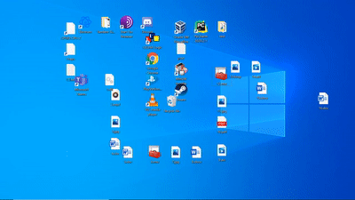

**DesktopController** is a library for programmatically manipulating desktop icons on Windows.

## Build
Debug and Release configurations will output a static library which is referenced by the samples (see below). pybind11_debug and pybind11_release configurations output a shared library as a .pyd file which includes Python bindings. This can be imported as a module from Python code.

NuGet is used to retrieve the appropriate version of Python for the Python bind configurations. There's no need to download third party libraries manually.

If you want to include DesktopController in your own project, either link the compiled static library and copy the relevant header files, or alternatively copy both the headers and the source files to your project. Additionally, ensure your project's character set is unicode.

## Documentation
Documentation can be viewed online at [deskctrl.web.app](https://deskctrl.web.app/). You can also generate the documentation by running `doxygen Doxyfile` in the doxygen directory.

## Samples
**Visual Studio projects.** Build as Debug or Release.

* DesktopSnake: Play a game of snake with your desktop icons.
* ListIcons: List basic information of icons on the desktop in various ways.

**Python.**

* list_icons.py
* folder_settings.py
* reposition_icons.py

## Demo

## TODO

* Testing for different systems and different versions of Windows.
* More samples.
* Inclusion in PyPi.